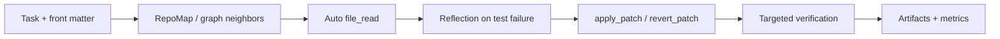

# Forge Agent 使用教程

自主编程智能体，支持对话式代码编辑、自动修复 Bug、运行测试，
支持 Claude、DeepSeek、OpenAI、Groq、Ollama 多种模型。

---

## 目录

1. [安装](#1-安装)
2. [配置](#2-配置)
3. [三种使用方式](#3-三种使用方式)
4. [chat 模式详解](#4-chat-模式详解)
5. [run 模式详解](#5-run-模式详解)
6. [GitHub Issue 模式](#6-github-issue-模式)
7. [查看运行日志](#7-查看运行日志)
8. [安全机制](#8-安全机制)
9. [Docker 沙箱](#9-docker-沙箱)
10. [写好任务描述的技巧](#10-写好任务描述的技巧)
11. [常见问题](#11-常见问题)
12. [配置参考](#12-配置参考)

---

## 1. 安装

**环境要求：** Python 3.11+、pip

```bash
# 克隆项目
git clone <repo-url>
cd forge-agent

# 创建虚拟环境（推荐）
python -m venv .venv
source .venv/bin/activate        # macOS/Linux
# .venv\Scripts\activate         # Windows

# 安装
pip install -e ".[dev]"

# 验证安装
agent --help
```

**可选：安装更多语言的代码解析支持**（让 repo-map 对更多语言精确分析）

```bash
pip install \
    tree-sitter-javascript \
    tree-sitter-typescript \
    tree-sitter-go \
    tree-sitter-rust \
    tree-sitter-java \
    tree-sitter-cpp \
    tree-sitter-c \
    tree-sitter-ruby
```

**可选：安装 tiktoken**（精确 token 计数，网络可访问时推荐）

```bash
pip install tiktoken
```

---

## 2. 配置

### 2.1 选择模型提供商

编辑 `config/default.yaml`，根据你使用的服务商填写：

**SiliconFlow + DeepSeek-V4-Flash（推荐，性价比高）**

```yaml
llm:
  provider: openai
  model: deepseek-ai/DeepSeek-V4-Flash   # 快速版，适合日常任务
  api_key: ${SILICONFLOW_API_KEY}
  base_url: https://api.siliconflow.cn/v1
```

**Anthropic Claude**

```yaml
llm:
  provider: anthropic
  model: claude-sonnet-4-5
  api_key: ${ANTHROPIC_API_KEY}
  base_url:                        # 留空
```

**OpenAI**

```yaml
llm:
  provider: openai
  model: gpt-4o
  api_key: ${OPENAI_API_KEY}
  base_url:                        # 留空
```

**Groq（速度极快，适合调试）**

```yaml
llm:
  provider: groq
  model: llama3-70b-8192
  api_key: ${GROQ_API_KEY}
  base_url: https://api.groq.com/openai/v1
```

**Ollama（本地运行，免费）**

```yaml
llm:
  provider: ollama
  model: llama3               # 本地已拉取的模型名
  api_key:                    # 留空
  base_url: http://localhost:11434/v1
```

### 2.2 设置 API Key

将 API Key 设置为环境变量（**不要**把 Key 明文写进 yaml 文件）：

```bash
# 写进 ~/.bashrc 或 ~/.zshrc，永久生效
export SILICONFLOW_API_KEY=sk-xxxxxxxxxxxxxxxx
export ANTHROPIC_API_KEY=sk-ant-xxxxxxxxxxxxxxxx
export OPENAI_API_KEY=sk-xxxxxxxxxxxxxxxx

# 重新加载（或重开终端）
source ~/.bashrc
```

### 2.3 验证配置

```bash
python scripts/smoke_test.py
```

看到 `✅ COMPLETE` 表示 API 联通、工具执行正常，可以开始使用。

---

## 3. 三种使用方式

| 方式 | 命令 | 适合场景 |
|------|------|---------|
| **chat** | `agent chat` | 持续对话，边改边聊，最常用 |
| **run** | `agent run --task "..."` | 一次性明确任务，批处理 |
| **GitHub Issue** | `python -m entry.github_issue` | 自动修复 Issue 并提 PR |

---

## 4. chat 模式详解

### 基本用法

```bash
# 在当前目录的项目上启动
cd /path/to/your/project
agent chat

# 指定项目目录
agent chat --repo /path/to/project

# 切换模型（不改配置文件）
agent chat --model deepseek-ai/DeepSeek-V4-Flash
agent chat --model gpt-4o --provider openai
```

### 交互界面

启动后进入交互界面：

```
🤖 Coding Agent — Chat Mode
  Provider : deepseek
  Model    : deepseek-ai/DeepSeek-V4-Flash
  Repo     : /your/project
  Type your task. Commands: /exit /stats /clear /help

you >
```

直接输入任务描述，按 Enter 发送。支持：
- **退格键**删除字符
- **↑↓ 方向键**翻历史输入
- **Ctrl+A** 跳到行首，**Ctrl+E** 跳到行尾

### 内置命令

| 命令 | 说明 |
|------|------|
| `/exit` 或 `/quit` | 退出 |
| `/stats` | 显示本次会话统计（轮次、步数、Token 消耗） |
| `/clear` | 清空对话历史，重新开始（不退出） |
| `/help` | 显示命令帮助 |

### 多轮对话示例

```
you > 帮我看一下这个项目有哪些模块

  Agent working...
  （agent 探索文件结构，逐字流式输出分析结果）

  ─── Round 1 · 2 steps · 1,234 tokens · 5.2s ───

you > utils.py 里的 parse_date 函数不能处理空字符串，修一下

  Agent working...
  （agent 读取文件、修改代码、运行测试）

  ─── Round 2 · 4 steps · 3,421 tokens · 12.1s ───

you > 给这个修复补上单元测试

  ─── Round 3 · 3 steps · 2,890 tokens · 9.3s ───

you > /stats

  Session stats:
    Rounds  : 3
    Steps   : 9
    Tokens  : 7,545
```

**关键特性：每轮对话结束后历史保留**，agent 下一轮能看到之前做了什么，不需要重复描述上下文。

### 输出结构说明

```
  Agent working...
  （流式打印模型思考内容）          ← 模型实时输出，逐字显示

  [1] shell  ls -la                 ← 第1步，调用 shell 工具
  ✓                                 ← 执行成功
    main.py utils.py parser.py      ← 输出前几行

  [2] file_read  src/parser.py      ← 第2步，读取文件
  ✓

  [3] apply_patch  src/parser.py    ← 第3步，应用结构化补丁
  ✓  Applied patch: replace_range

  [4] test  tests/                  ← 第4步，运行测试
  ✓  5 passed in 0.12s

  ⟳ Reflection (test_failed)        ← 测试失败时自动反思

  ─── Round 2 · 4 steps · 3,421 tokens · 12.1s ───
```

---

## 5. run 模式详解

适合任务描述明确、不需要来回交互的场景。

### 基本用法

```bash
# 最简单：在当前目录执行任务
agent run --task "修复所有 failing 的测试"

# 指定 repo
agent run --repo /path/to/project --task "重构 api.py，拆分成更小的函数"

# 任务描述写在文件里（推荐用于复杂任务）
agent run --task-file task.txt
```

### 所有选项

```
-r, --repo TEXT       目标 repo 路径（默认当前目录）
-t, --task TEXT       任务描述（自然语言）
-f, --task-file TEXT  从文件读取任务描述
-m, --model TEXT      覆盖模型名
-p, --provider TEXT   覆盖 provider
    --max-steps INT   最大步数（默认 40）
-s, --stream          流式输出（默认开启）
    --confirm         危险命令需要用户确认
    --sandbox         在 Docker 沙箱里执行命令
-v, --verbose         显示 debug 日志
```

### 运行工件

`agent run` 结束后会自动导出一份可回放的工件目录，便于离线分析和 benchmark 统计。

默认会生成在日志目录下的 `artifacts/<task_id>_<timestamp>/`，目录里通常包含：

- `events.json`：结构化事件流
- `metrics.json`：基础指标统计
- `run_manifest.json`：模型配置、代码版本、任务版本、运行环境、source repo / workspace repo
- `retrievals.json`：检索命中记录
- `patches.json`：结构化 patch 轨迹
- `result.json`：任务结果摘要
- `final_diff.patch`：最终 diff（如果任务产生了改动）

如果你要看一次运行到底“检索了什么、改了什么、测了什么”，优先看这个目录。

### 典型使用场景

```bash
# 修复特定测试
agent run --task "tests/test_api.py::test_auth 报错 KeyError，修复它"

# 添加功能
agent run --task "在 src/api.py 里添加 /health 接口，返回 {status: ok, version: 1.0}"

# 代码重构
agent run --task "把 utils.py 里超过 50 行的函数拆分成更小的函数，保持测试通过"

# 安全执行（危险命令需确认）
agent run --task "清理项目，删除所有 .pyc 文件和 __pycache__ 目录" --confirm

# Docker 沙箱（命令在容器里执行，不影响宿主机环境）
agent run --task "安装依赖并运行测试" --sandbox
```

---

## 6. GitHub Issue 模式

自动从 GitHub Issue 拉取任务描述，运行 agent，完成后创建 PR。

### 准备工作

```bash
# 设置 GitHub Token（需要 repo 权限）
export GITHUB_TOKEN=ghp_xxxxxxxxxxxxxxxx
```

在 GitHub → Settings → Developer settings → Personal access tokens 创建，
勾选 `repo` 权限。

### 使用

```bash
python -m entry.github_issue \
    --repo owner/repo-name \
    --issue 42 \
    --local-path /tmp/myrepo
```

**参数说明：**

```
-r, --repo TEXT         GitHub 仓库（格式：owner/repo）
-i, --issue INTEGER     Issue 编号
-l, --local-path TEXT   本地路径（会自动 clone，已存在则直接用）
-c, --config TEXT       配置文件路径
    --no-pr             只修复代码，不创建 PR
    --base-branch TEXT  PR 目标分支（默认 main）
-v, --verbose           显示详细日志
```

**执行流程：**

1. 拉取 Issue #42 的标题和描述作为任务
2. Clone repo 到 `/tmp/myrepo`（已存在则跳过）
3. 创建新分支 `agent/fix-issue-42-xxxxxxxx`
4. 在新分支上运行 agent 完成任务
5. Push 分支到远端
6. 自动创建 PR，标题和描述自动生成

---

## 7. 查看运行日志

每次运行会在 `./logs/` 目录下生成 JSONL 格式的事件日志，记录完整的运行过程。

### 列出日志文件

```bash
agent log list
agent log list --dir ./logs    # 指定日志目录
```

输出示例：

```
Log files in ./logs:

  abc12345_20250525_143022.jsonl  (12.3 KB)
  def67890_20250524_091534.jsonl  (8.7 KB)
```

### 查看单次运行详情

```bash
agent log show logs/abc12345_20250525_143022.jsonl
```

输出示例：

```
Event Log: abc12345_20250525_143022.jsonl
  Total events : 18
  Actions      : 6
  Reflections  : 1
  Tool calls   : {'shell': 2, 'file_read': 1, 'apply_patch': 1, 'test': 2}
  Final status : task_complete

Events:
  14:30:22  task_start
  14:30:25  action          tool=shell
  14:30:25  observation     status=success
  14:30:28  action          tool=file_read
  ...
  14:30:51  task_complete
```

日志文件是标准 JSON Lines 格式，每行一个事件，可以用任何工具分析：

```bash
# 用 jq 查看所有 action
cat logs/abc12345_*.jsonl | jq 'select(.event_type=="action") | .payload.action.thought'

# 统计工具调用次数
cat logs/abc12345_*.jsonl | jq 'select(.event_type=="action") | .payload.action.tool_call.name' | sort | uniq -c
```

### 查看工件目录

```bash
ls logs/artifacts
cat logs/artifacts/abc12345_20250525_143022/metrics.json | jq '.'
```

这类工件特别适合做：

- offline debugging
- retrieval 命中分析
- graph_neighbors 关系分析
- 失败后自动图探测 / 自动 file prefetch 的轨迹分析
- patch 成功率统计
- patch 冲突 / 回滚统计
- benchmark 汇总

### 看图效果

如果你想直接验证图结构代码理解是否真的生效，推荐跑一条小任务，再看工件里的 `retrievals.json`：

```bash
agent benchmark run --repo . --tasks-dir ./benchmark_tasks --task-glob "03_run_demo.txt" --limit 1
cat logs/artifacts/<run_id>/retrievals.json | jq '.'
```

重点看这些字段：

- `graph_neighbors` 是否出现
- `auto_graph_probe` 是否为 `true`
- `auto_file_prefetch` 是否为 `true`
- `matches` 里是否优先出现了目标文件和它的一跳邻居

如果这些都出现了，说明图结构不仅被看到了，而且真的参与了后续工具调用。

### 典型轨迹



这条链路里最值得看的，就是图分析有没有把 `file_read` 的对象选对，以及后续 `apply_patch` 是否只改了最小范围。

如果你想直接看多次运行的整体结果：

```bash
agent benchmark summarize --dir ./logs/artifacts
agent benchmark summarize --dir ./logs/artifacts --only-agent-runs
agent benchmark summarize --dir ./logs/artifacts --json-output
agent benchmark summarize --dir ./logs/artifacts --markdown-out ./summary.md
agent benchmark compare --left ./logs/baseline/artifacts --right ./logs/new/artifacts
agent benchmark compare --left ./logs/baseline/artifacts --right ./logs/new/artifacts --only-agent-runs
agent benchmark compare --left ./logs/baseline/artifacts --right ./logs/new/artifacts --markdown-out ./compare.md
agent benchmark run --repo . --tasks-dir ./benchmark_tasks
agent benchmark run --repo . --tasks-dir ./benchmark_tasks --task-glob "*.txt" --limit 2
agent benchmark patch-replay --artifact-dir ./logs/artifacts/<run_id> --repo ./benchmark_fixtures/run_demo
agent benchmark reset-fixtures --repo .
```

如果任务文件带 front matter，`benchmark run` 还会自动使用任务自己的 `repo`、`test_path`、`test_cmd`、`lint_cmd`、`patch_policy_cmd`、`exclude_paths`、`target_files`、`max_steps` 和 `finish_if_verified` 设置。`test_cmd` 会被封装成 `CommandGrader`；如果再声明 `lint_cmd` 或 `patch_policy_cmd`，则会自动组合成 `CompositeGrader`。
每个任务每次运行前都会先复制到独立 workspace，再在 workspace 里跑 agent 和 grader。artifact 里的 `run_manifest.json` 会记录 `repo_source`、`workspace_repo`、模型配置、代码版本、任务文件 hash 和运行环境。仓库里推荐把 benchmark 任务指向 `benchmark_fixtures/`，把试玩或教学场景留给 `demo/`。
默认的 `--skip-preverified` 会在进入 LLM 前先跑目标验证；如果任务已经是通过状态，就直接记成一次成功的 benchmark 工件，`steps=0`、`tokens=0`。
如果你想排除这些预检直接通过的样本，在 `summarize` 或 `compare` 时加 `--only-agent-runs`。如果 benchmark 把 fixture 改脏了，可以用 `benchmark reset-fixtures` 恢复到未修复初始态。
新的 benchmark 汇总还会显示 `graph_queries`、`patch_conflicts`、`patch_reverts`、`failure_type_distribution` 和 `failure_stage_distribution`。每条 run 也会输出 `failure_type`、`failure_stage`、`failure_message`，方便区分是 agent、grading、workspace 还是模型层出了问题。
Markdown report 现在使用固定模板，包含总成功率、任务数、平均 steps、平均 tokens、平均耗时、失败类型分布、每个任务结果、patch 文件和 baseline 对比。
如果你想重放某次结构化 patch，可以直接用 `benchmark patch-replay`；加 `--reverse` 会重放对应的 `reverse_patch`。

---

## 8. 安全机制

Agent 有三层保护，防止误操作：

### 层 1：硬拦截黑名单（永远不执行，不问用户）

以下命令会被直接拒绝，任何情况下都不执行：

- `rm -rf /`、`rm -rf ~`
- `mkfs`（格式化磁盘）
- `dd if=`（磁盘写入）
- `:(){:|:&};:`（fork bomb）
- `chmod -R 777 /`
- `> /dev/sda`

### 层 2：只读白名单（直接执行，不需确认）

以下命令被认为是安全的只读操作，直接执行：

`ls`、`cat`、`grep`、`find`、`git status`、`git diff`、`git log`、
`pytest`、`python -m pytest`、`echo`、`pwd`、`diff`、`tree` 等

### 层 3：写操作确认（仅在 `--confirm` 模式下）

以下命令需要用户确认：

`rm`、`mv`、`pip install`、`git commit`、`git push`、`curl`、`wget`、
`chmod`、`sudo`、`docker`、重定向覆盖（`>`）等

**默认行为（不加 `--confirm`）**：层 3 跳过，直接执行。适合自动化场景。

**开启确认（加 `--confirm`）**：遇到写操作会提示：

```
  ⚠  Agent wants to run:
     $ git commit -m "fix parser bug"
  Allow? [y/N]
```

**chat 模式默认开启确认**，每次执行危险命令都会询问。

---

## 9. Docker 沙箱

加 `--sandbox` 参数，所有 shell 命令、测试、git 操作都在 Docker 容器里执行，
宿主机环境完全隔离。

### 前提

确保 Docker Desktop 已安装并运行：

```bash
docker --version
docker info    # 应该能正常输出
```

### 使用

```bash
# run 模式开启沙箱
agent run --task "安装依赖并运行所有测试" --sandbox

# chat 模式开启沙箱
agent chat --sandbox
```

首次使用会拉取 `python:3.11-slim` 镜像（约 150MB），之后复用。

### 沙箱特性

- 容器默认**断网**（`--network none`），防止 agent 随意发网络请求
- repo 目录通过 bind mount 挂载进容器，**文件修改双向可见**
  - 宿主机写的文件，容器里能读到
  - 容器里修改的文件，宿主机立刻看到
- 容器在 session 结束时**自动清理**

---

## 10. 写好任务描述的技巧

任务描述的质量直接决定 agent 的效果。

### 基本原则：具体 > 模糊

```bash
# ❌ 太模糊，agent 不知道从哪里下手
agent run --task "fix bug"

# ✅ 具体说明文件、现象、预期结果
agent run --task "src/parser.py 的 parse() 函数在输入空字符串时抛 ValueError，
应该返回 None。修复它并在 tests/test_parser.py 里补上这个 case 的测试。"
```

### 描述模板

```
[文件/模块]里的[函数/类]在[什么情况]下[出现什么问题]，
应该[预期行为]。
[可选：修复后运行什么测试验证]
```

### 常见任务写法

**修复 Bug：**
```
tests/test_api.py::test_auth_token 报错 KeyError: 'user_id'。
原因可能在 src/auth.py 的 verify_token() 函数里。
修复它，确保测试通过。
```

**添加功能：**
```
在 src/api.py 里添加 GET /api/v1/health 接口，
返回 JSON：{"status": "ok", "version": "1.0.0", "timestamp": <当前UTC时间>}。
同时在 tests/test_api.py 里补上这个接口的测试。
```

**重构代码：**
```
src/utils.py 里的 process_data() 函数现在有 200 行，太长了。
把它拆分成几个职责单一的小函数，保持所有现有测试通过。
不要改变函数的对外接口。
```

**代码审查式任务：**
```
帮我检查 src/ 目录下所有 Python 文件，找出：
1. 没有类型注解的公开函数
2. 超过 50 行的函数
3. 重复的代码片段
列出清单就好，不需要修改。
```

### 复杂任务用文件

```bash
cat > task.txt << 'EOF'
重构 src/database.py 模块：

1. 当前问题：
   - DatabaseManager 类有 15 个方法，职责不清晰
   - 连接池逻辑和查询逻辑混在一起
   - 没有错误处理

2. 目标：
   - 拆分成 ConnectionPool、QueryExecutor 两个类
   - 每个类不超过 8 个方法
   - 添加适当的异常处理（用自定义异常类）
   - 保持现有的所有测试通过

3. 不要改变：
   - 对外的 API 接口（其他模块 import 的部分）
   - tests/ 目录下的任何文件
EOF

agent run --task-file task.txt
```

---

## 11. 常见问题

**Q：agent 没有任何输出，卡住了**

先跑 `python scripts/smoke_test.py` 检查 API 是否联通。如果网络正常但还是卡，
可能是模型响应慢，加 `--verbose` 看详细日志：
```bash
agent chat --verbose
```

**Q：agent 陷入循环，一直重复同样的操作**

内置循环检测会自动处理（连续 3 步完全相同的操作会触发 GIVE_UP）。
如果想提前中断，按 `Ctrl+C`，然后 `/clear` 清空历史重新描述任务。

**Q：测试失败后 agent 怎么处理**

内置 Reflection 机制：测试失败时 agent 会自动重新分析错误原因，
尝试不同的修复策略，最多继续尝试直到达到 `max_steps` 上限。

**Q：修改了文件但不满意，怎么撤销**

agent 不自动 commit，所有修改都在工作区。直接用 git 撤销：
```bash
git checkout -- .          # 撤销所有未提交的修改
git checkout -- src/foo.py # 撤销特定文件
```

**Q：token 消耗太多**

几个节省 token 的方法：
```bash
# 用 flash 版本替代 pro 版本
agent chat --model deepseek-ai/DeepSeek-V4-Flash

# 缩小 repo-map 预算（减少上下文注入量）
# 编辑 config/default.yaml：
context:
  repo_map_budget: 4000    # 从 8000 降到 4000

# 减少历史窗口
context:
  history_window: 10       # 从 20 降到 10
```

**Q：沙箱模式里没有项目需要的依赖**

在任务描述里告诉 agent 先安装：
```bash
agent run --task "先运行 pip install -r requirements.txt，然后运行所有测试" --sandbox
```
或者用 setup_cmds 在容器启动时预装（需要在代码里配置）。

**Q：GitHub Issue 模式提 PR 失败**

检查 GITHUB_TOKEN 是否有 `repo` 权限。如果只想修代码不提 PR：
```bash
python -m entry.github_issue --repo owner/repo --issue 42 \
    --local-path /tmp/myrepo --no-pr
```

---

## 12. 配置参考

`config/default.yaml` 完整说明：

```yaml
llm:
  provider: openai                         # 模型提供商
  model: deepseek-ai/DeepSeek-V4-Flash     # 模型名
  api_key: ${SILICONFLOW_API_KEY}          # 环境变量引用
  base_url: https://api.siliconflow.cn/v1  # OpenAI-compatible 时填写
  max_tokens: 4096            # 最大输出 token 数

agent:
  max_steps: 40               # 每轮最大步数（超出则停止）
  budget_tokens: 80000        # 每轮 token 预算
  log_dir: ./logs             # 日志目录

tools:
  shell:
    timeout: 30               # shell 命令超时秒数
    max_output_tokens: 8000   # 输出截断长度（防止超长输出爆上下文）
  file:
    max_view_lines: 100       # file_view 每次显示的最大行数

context:
  repo_map_budget: 8000       # repo-map 注入 system prompt 的最大 token 数
  history_window: 20          # 保留最近 N 轮对话历史
```

### 多环境配置

可以维护多个配置文件，用 `-c` 参数指定：

```bash
# 日常开发用 flash（快且省钱）
agent chat -c config/dev.yaml

# 复杂任务用 pro
agent run --task "..." -c config/pro.yaml
```

`config/dev.yaml` 示例：

```yaml
llm:
  provider: openai
  model: deepseek-ai/DeepSeek-V4-Flash
  api_key: ${SILICONFLOW_API_KEY}
  base_url: https://api.siliconflow.cn/v1

agent:
  max_steps: 20               # 开发时少一点，节省时间
  budget_tokens: 40000

context:
  repo_map_budget: 4000
  history_window: 10
```

---

## 快速参考卡

```bash
# 安装
pip install -e ".[dev]"

# 设置 Key
export SILICONFLOW_API_KEY=sk-xxx

# 验证
python scripts/smoke_test.py

# 日常使用
cd your-project
agent chat                          # 开启对话
agent chat --model deepseek-ai/DeepSeek-V4-Flash  # 切换模型

# 一次性任务
agent run --task "fix the failing tests"
agent run --task-file task.txt

# 编辑偏好
# 默认优先使用 apply_patch；只有整文件重写时才用 file_write

# 安全选项
agent run --task "..." --confirm    # 危险命令需确认
agent run --task "..." --sandbox    # Docker 沙箱

# GitHub Issue
export GITHUB_TOKEN=ghp_xxx
python -m entry.github_issue -r owner/repo -i 42 -l /tmp/repo

# 查看日志
agent log list
agent log show logs/xxx.jsonl

# 对话内命令
# /exit   退出
# /stats  查看统计
# /clear  清空历史
# /help   帮助
```
